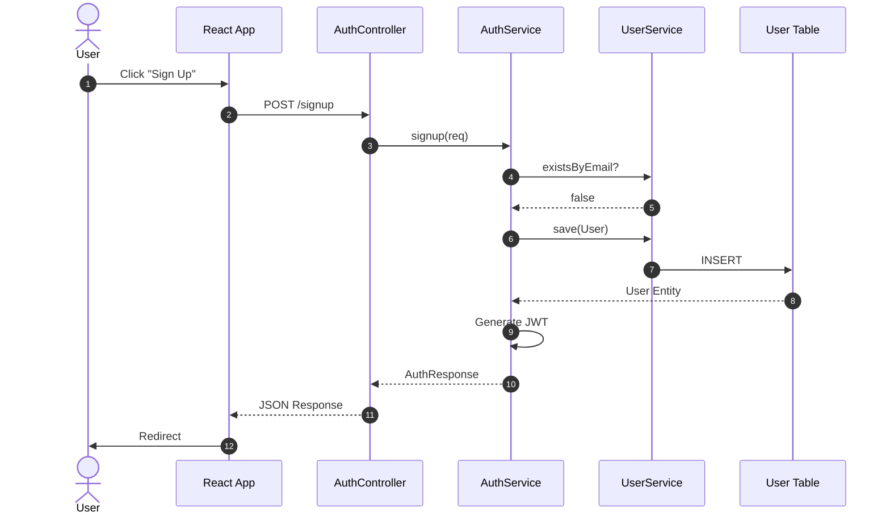
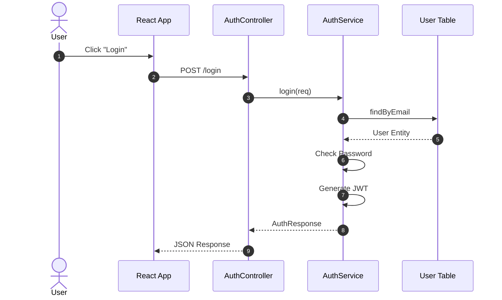

# 01. Authentication Architecture Flow

This document details the architecture and data flow for **User Signup** and **User Login**.

## 1. Signup Flow

**Scenario**: A new user registers an account.
**Endpoint**: `POST /api/auth/signup`

### Data Structures
*   **Request**: `{ "name": "John", "email": "john@example.com", "password": "pass", "role": "CUSTOMER" }`
*   **Response**: `{ "userId": 1, "token": "jwt_token_string", ... }`

---

## 2. Login Flow

**Scenario**: Existing user logs in.
**Endpoint**: `POST /api/auth/login`

### Data Structures
*   **Request**: `{ "email": "john@example.com", "password": "pass" }`
*   **Response**: `{ "userId": 1, "token": "jwt_token_string", ... }`

## Draw.io Shape Guide
*   **User**: Stickman
*   **Frontend/Controller/Service**: Rectangle
*   **Database**: Cylinder
