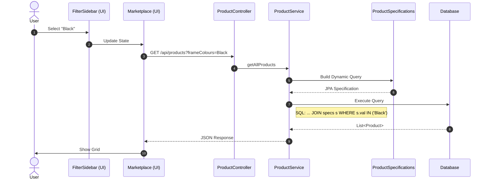

# 02. Product Filter & Search Flow

This document details the architecture for filtering products (by Category, Brand, Price, Frame Colour) and searching.

## 1. Filter Flow

**Scenario**: User filters by "Frame Colour: Black".
**Endpoint**: `GET /api/products?frameColours=Black`

### Data Structures
*   **Request Params**: `frameColours=Black`, `page=0`, `size=12`
*   **Response**: `Page<Product>` JSON object.

## Draw.io Shape Guide
*   **User**: Stickman
*   **UI Components**: Blue Rectangle
*   **Backend Classes**: Green Rectangle
*   **Database**: Cylinder
*   **Query Logic**: Diamond or Parallelogram
