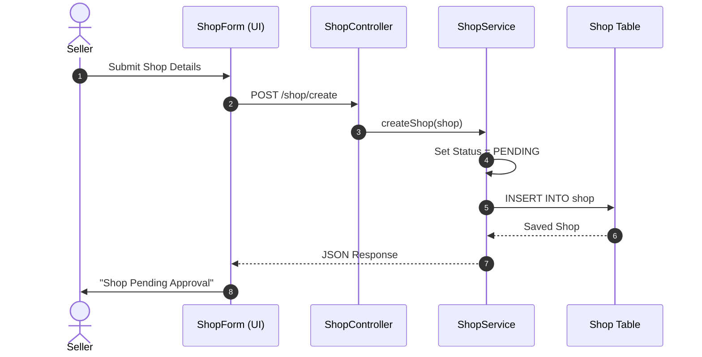
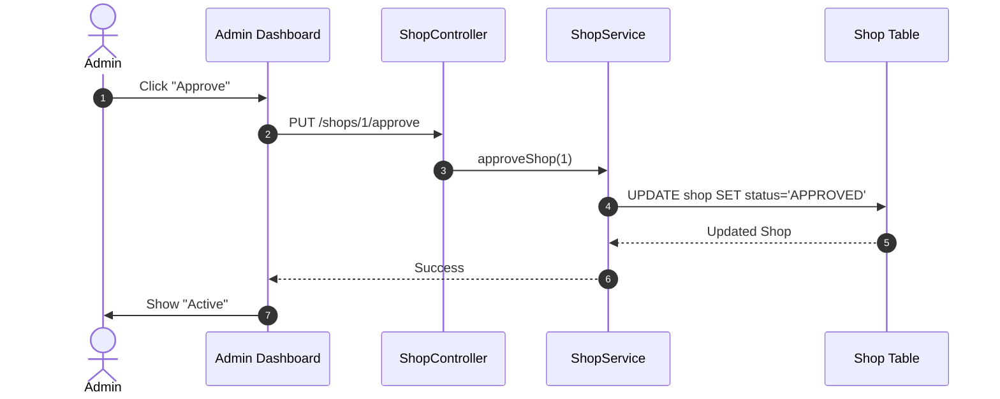

# 03. Shop Management Flow

This document details the architecture for **Creating**, **Approving**, and **Rejecting** shops.

## 1. Create Shop (Seller)

**Scenario**: A Seller requests to open a new shop.
**Endpoint**: `POST /api/shop/create`

### Data Structures
*   **Request**: `{ "name": "BestSpecs", "description": "Quality glasses", ... }`
*   **Response**: Shop Object with `status: "PENDING"`.

---

## 2. Approve Shop (Admin)

**Scenario**: Admin approves a pending shop.
**Endpoint**: `PUT /api/admin/shops/{id}/approve`

## Draw.io Shape Guide
*   **Actors**: Stickman (Seller / Admin)
*   **Code Components**: Rectangle
*   **Database**: Cylinder
