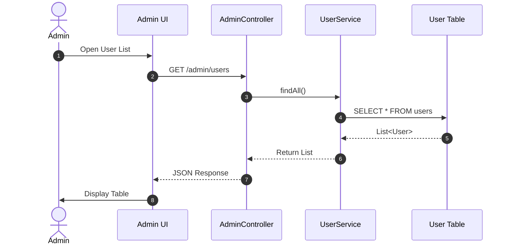
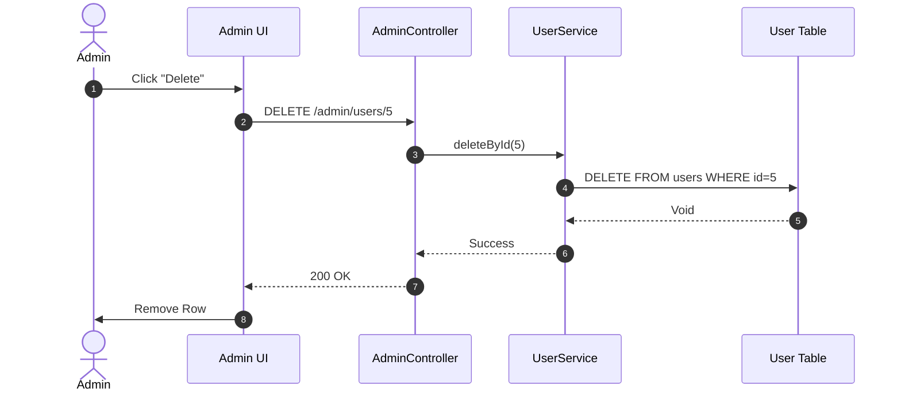

# 04. Admin User Management Flow

This document details the architecture for Admin operations on Users.

## 1. Get All Users

**Scenario**: Admin views list of all registered users.
**Endpoint**: `GET /api/admin/users`

### Data Structures
*   **Request**: None (JWT Token required in Header)
*   **Response**: `List<User>`

## 2. Delete User

**Scenario**: Admin bans/deletes a user.
**Endpoint**: `DELETE /api/admin/users/{id}`

## Draw.io Shape Guide
*   **Admin**: Stickman
*   **Dashboard/Controller/Service**: Rectangle
*   **Database**: Cylinder
